# 🏦 Fortress BankingSystemEE (Enterprise Full-Stack Portal)

An **end-to-end secure, cloud-deployed banking system** coupling a highly responsive **Angular 17 Single Page Application (SPA)** with a robust **Jakarta EE 10 micro-monolith backend**. Designed to handle **high-concurrency transactions**, **scheduled recurring transfers**, **PayHere payment gateway integration**, **real-time WebSocket notifications**, strict **Role-Based Access Control (RBAC)** via **JWT**, and **Generative AI fraud detection** powered by Google Gemini and xAI.

---

## 📌 Core Features & Enterprise Capabilities

✅ **Decoupled Full-Stack Architecture:** Standalone Angular UI communicating securely with Jakarta EE REST endpoints (JAX-RS) via Nginx reverse proxies.

✅ **Stateless Security:** Complete implementation of **JWT (JSON Web Tokens)** with custom Auth Interceptors, replacing legacy server-side sessions.

✅ **AI-Powered Admin Insights:** Real-time transaction risk profiling and anomaly detection using Google Gemini and xAI LLMs.

✅ **Two-Step Payment Verification:** PayHere MD5-hashed checkout flows with asynchronous Webhook validation to transition funded accounts from `PENDING` to `ACTIVE`.

✅ **Manual & Scheduled Transfers:** Real-time processing, daily/weekly cycles, and automated 3-retry fallback logic for failed transfers.

✅ **Asynchronous Processing:** EJB Timer Services for midnight interest calculations and fixed deposit maturity pipelines.

✅ **Real-time Notifications:** WebSockets pushing live alerts to the Admin dashboard for high-value transactions (>= Rs. 50,000) and new registrations.

✅ **Comprehensive Audit & Performance Logging:** Custom Java Interceptors (`@Audit`, `@Performance`, `@Logging`) tracking method execution times and sensitive actions.

✅ **Concurrency Safety:** Safe multi-threaded transaction handling utilizing JTA/CMT, database-level locking, and Singleton read/write locks.

✅ **Email Notifications:** JavaMail API integration for registration approvals, password resets, and account blocking events.

✅ **Reporting:** Dynamic PDF receipt generation for transactions and admin audit reports.

---

## 🖥️ Application Interfaces & User Flows

| Feature / Interface |                                                       Interface Preview                                                        | Workflow & Business Logic |
| :--- |:------------------------------------------------------------------------------------------------------------------------------:| :--- |
| **Authentication: Registration** |                                     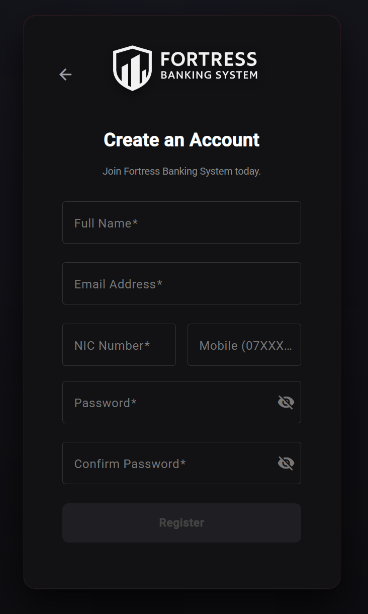                                      | **Flow:** Users submit KYC details. The backend mathematically salts and hashes passwords via BCrypt before database insertion. Accounts are flagged as `INACTIVE`/`PENDING` and require manual Admin approval before login is permitted. |
| **Authentication: JWT Login** |                                       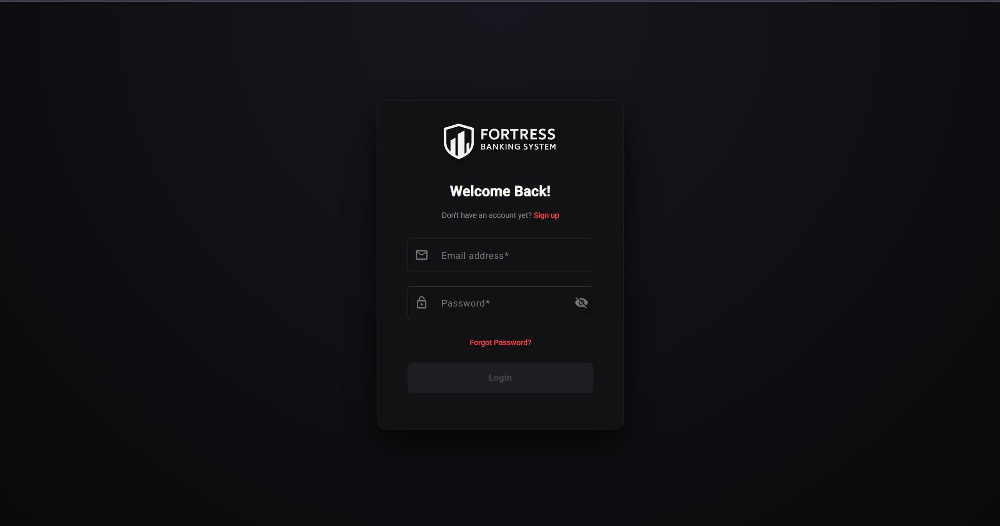                                       | **Flow:** Legacy sessions are replaced by stateless JSON Web Tokens. A custom `@PreMatching` CorsFilter and `JwtAuthFilter` intercept the credentials, validate the signature, and extract user claims (`@RolesAllowed("CUSTOMER")`) into the JAX-RS request context. |
| **Customer Dashboard** |                                   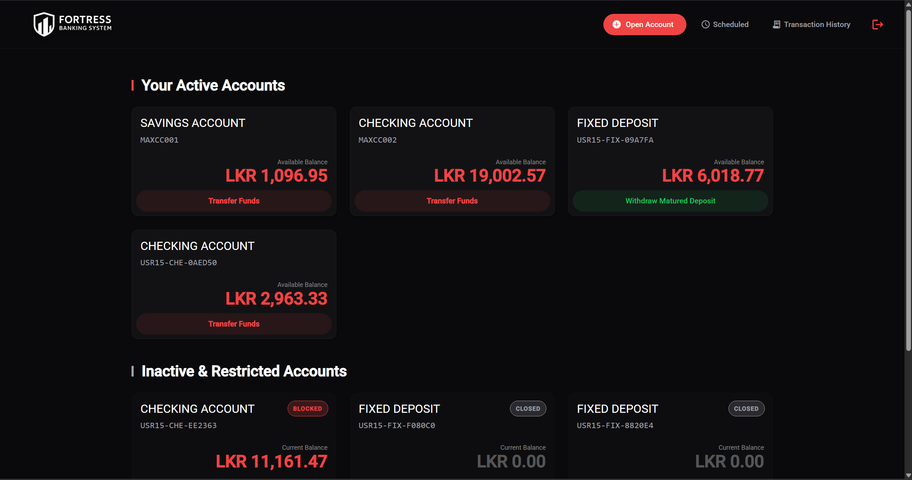                                   | **Flow:** The central hub utilizing Angular RxJS observables to fetch real-time aggregated balances. Displays active Checking, Savings, and Fixed Deposit accounts with visual status indicators and quick-action routing. |
| **Account Creation & PayHere Gateway** |       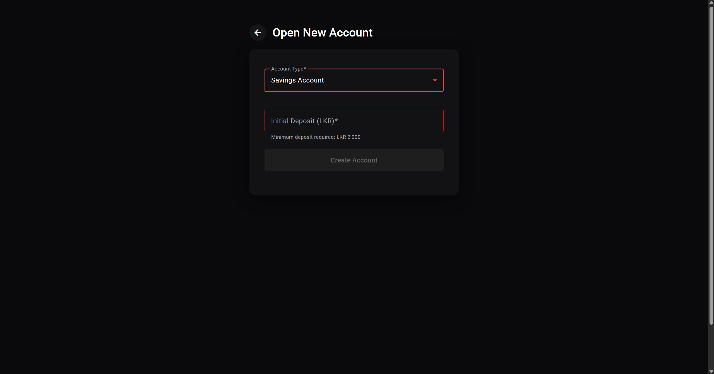<br><br>       | **Flow:** When opening an account requiring an initial deposit (e.g., Rs. 1000 for Savings), the backend creates a `PENDING` account, generates an MD5 cryptographic hash, and launches the PayHere modal. An asynchronous webhook securely verifies the gateway signature and flips the account to `ACTIVE` upon payment confirmation. |
| **Manual Fund Transfers** |                                    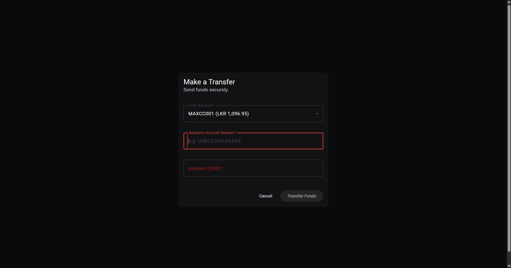                                     | **Flow:** Immediate inter-account transfers governed by strict Container-Managed Transactions (CMT). Enforces minimum balance requirements and prevents overdrafts during concurrent database write requests via row-level locking. If a database failure occurs mid-transfer, the entire transaction rolls back via JTA. |
| **Scheduled & Recurring Transfers** | 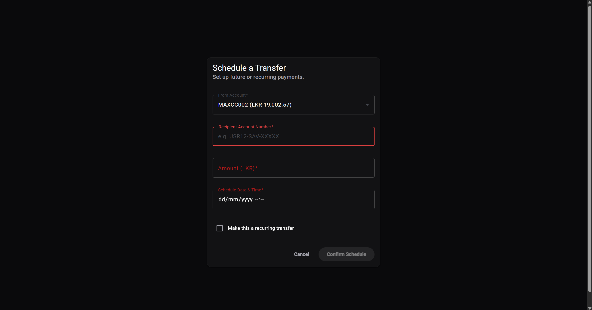<br><br>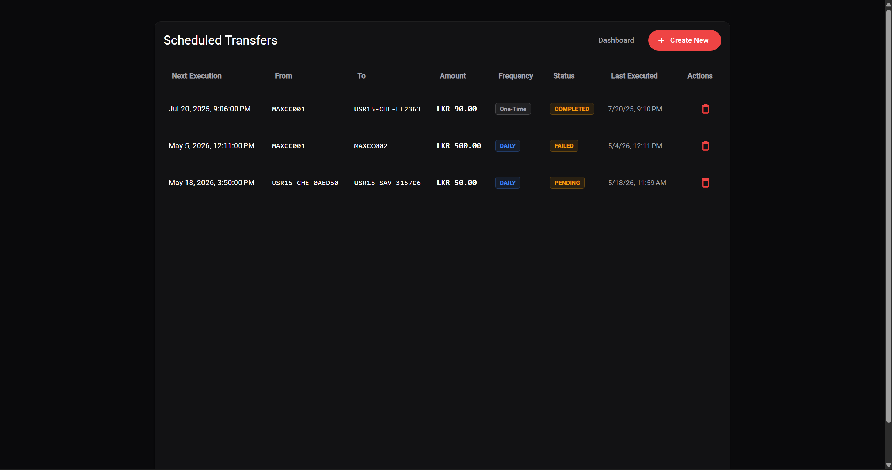 | **Flow:** Users configure one-time or recurring (daily, weekly, monthly) transfers. An EJB `@Schedule` polling bean executes these asynchronously at midnight, utilizing a cron-based 3-attempt retry logic for failed executions due to insufficient funds. |
| **Transaction Ledger** |                                  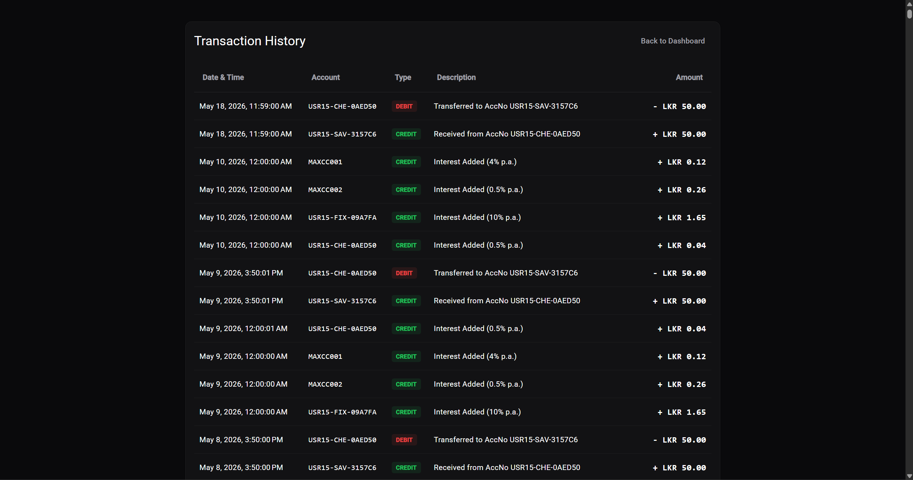                                   | **Flow:** Paginated and sortable ledger of all credits and debits. Automatically tracks execution times via custom `@Performance` Java Interceptors to identify backend bottlenecks. |
| **PDF Receipt Export** |                                      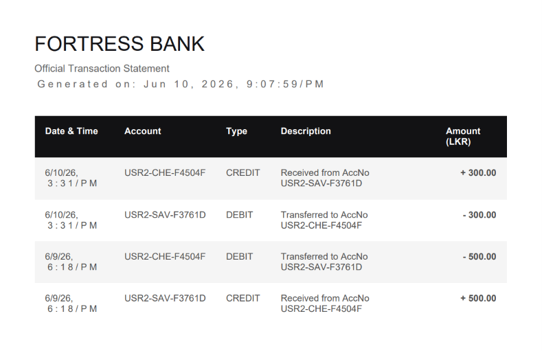                                       | **Flow:** Users can filter the ledger by date/account and instantly generate standard-compliant PDF transaction receipts dynamically on the client-side. |
| **Admin Dashboard & Live Alerts** |                                    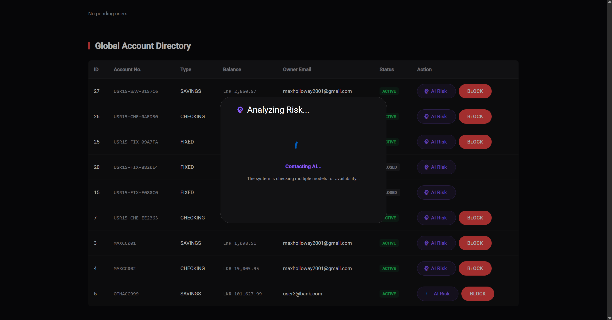                                     | **Flow:** The control center. Uses a persistent WebSocket connection to push live, unrefreshed alerts directly to the Admin UI whenever a transfer exceeds Rs. 50,000 or a new user attempts registration. |
| **Admin AI Fraud Detection** |                                        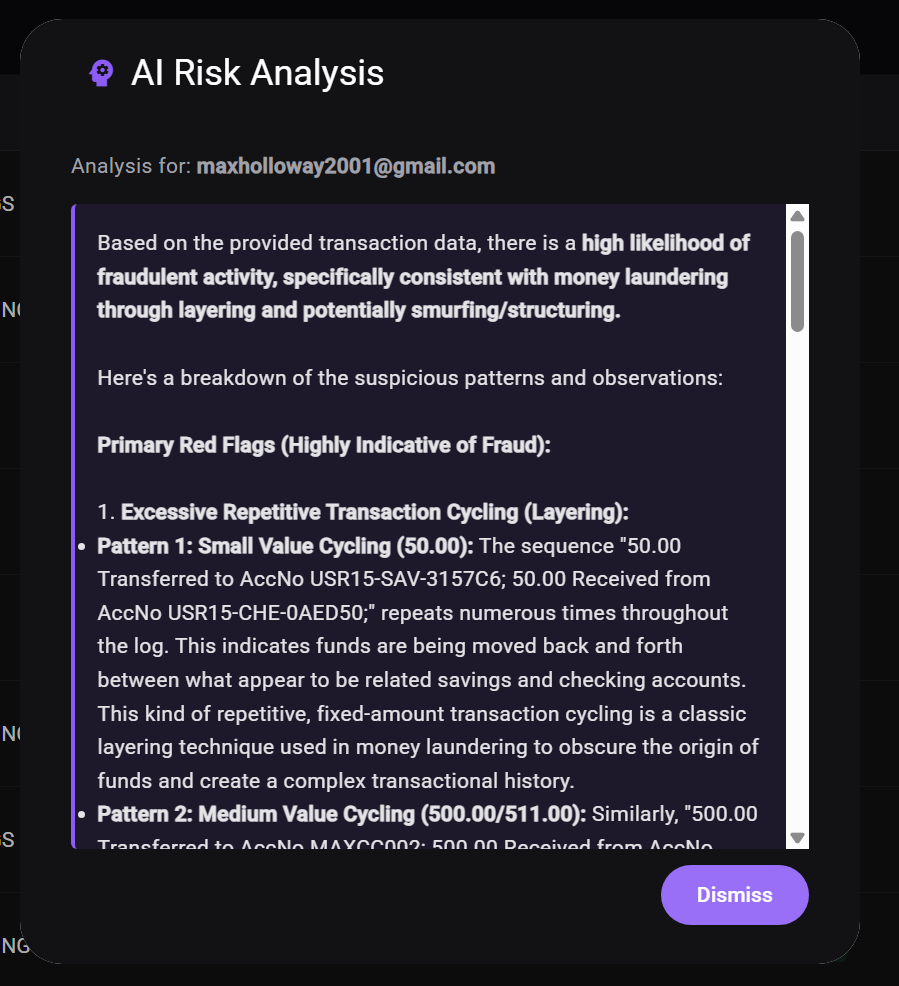                                        | **Flow:** Admins trigger an AI audit on specific users. The backend aggregates the user's historical transaction data and prompts Google Gemini / xAI, generating a JSON-formatted risk score (0-100) and a plain-text analysis of spending anomalies. |

---

## 📚 Technology Stack

| Layer | Technology |
| --- | --- |
| **Frontend** | Angular 17, TypeScript, SCSS, RxJS, Chart.js, Angular Material |
| **Backend API** | Jakarta EE 10, JAX-RS (REST), EJB (Stateless, Singleton), Servlets |
| **Security** | JWT (jjwt), BCrypt, Custom Auth Filters (`@RolesAllowed`) |
| **Payments** | PayHere Gateway (Checkout API & Asynchronous Webhooks) |
| **AI Integration** | Google Gemini LLM API, xAI API (Fraud Anomaly Detection) |
| **Database & ORM** | MySQL 8.0, JPA (Hibernate), Transactions (JTA, BMT, CMT) |
| **Real-time/Async** | WebSockets, EJB Timer Service (`@Schedule`), JavaMail API |
| **DevOps & Cloud** | Docker, Docker Compose, Nginx (Reverse Proxy), DigitalOcean (Ubuntu) |
| **Testing** | JUnit 5, Mockito (Unit/Integration Testing) |

---

## ⚙️ Enterprise Architecture & Business Logic

### Concurrency & Transaction Management

* **Container-Managed Transactions (CMT):** Utilizes EJB `@TransactionAttribute(TransactionAttributeType.REQUIRED)` to ensure atomicity. If a database failure occurs during a transfer between two accounts, the entire transaction automatically rolls back.
* **Bean-Managed Transactions (BMT):** Utilized in specific edge cases where granular commit boundaries are required.
* **Concurrency Locking:** Employs `@Lock(LockType.WRITE)` and `@Lock(LockType.READ)` on Singleton beans to prevent race conditions during parallel processing of scheduled tasks and interest applications.

### 🔐 Security Architecture

1. **Stateless Authentication:** Legacy Servlet sessions completely replaced by JSON Web Tokens (JWT).
2. **Password Protection:** Passwords securely hashed and salted using BCrypt before database insertion.
3. **Auth Interception:** A custom `@PreMatching` `CorsFilter` and `JwtAuthFilter` intercept all `/api/*` REST requests, validate the Bearer token signature, and extract user claims into the JAX-RS request context.
4. **Endpoint Authorization:** Programmatic security using `@RolesAllowed("ADMIN")` and `@RolesAllowed("CUSTOMER")` is utilized extensively across REST resources and EJBs to prevent unauthorized execution.
5. **Gateway Verification:** MD5 Signature verification is strictly enforced on the PayHere webhook endpoint to prevent spoofed payment confirmations.
6. **Environment Isolation:** Sensitive API keys (Gemini, PayHere, Mail Credentials, DB passwords) are entirely abstracted from the codebase using `.env` files and Docker runtime environment variables.

---

## ⏲️ Timer Services & Async Processing

| Timer Service | Purpose |
| --- | --- |
| **TimerSessionBean** | Daily interest application at 00:00 hrs and Fixed Deposit Maturity status updater at 00:30 hrs. |
| **ScheduledTransactionPollingBean** | Polls every 5 minutes to process due scheduled/recurring transfers. |
| **Failure Handling** | Retries failed transactions 3 times; permanently marks `FAILED` after 3 unsuccessful attempts. |
| **Downtime Recovery** | Catch-up logic ensures any missed transaction or interest calculation is processed immediately after server restarts. |

---

## 📊 Interest & Fixed Deposit Business Rules

| Account Type | Daily Interest Rate | Special Rules |
| --- | --- | --- |
| **CHECKING** | 0.5% annually | No minimum balance restriction. |
| **SAVINGS** | 4% annually | Minimum balance Rs. 1000 enforced. Transfers blocked if threshold is breached. |
| **FIXED DEPOSIT** | 10% annually | Locked until maturity. **Premature Closure:** Refund initial deposit only, interest forfeited. **Matured:** Full refund + total interest. |

---

## 📝 Logging, Auditing, & Interceptor Coverage

The system heavily utilizes Java EE Interceptors to separate cross-cutting concerns from core business logic:

| Interceptor | Role & Functionality |
| --- | --- |
| **`@Audit`** | Bound to critical EJB methods (transfers, closures, admin actions). Silently logs the user context, action type, and timestamp to a secure audit ledger. |
| **`@Performance`** | Wraps high-computation methods. Calculates execution time in milliseconds to identify backend bottlenecks. |
| **`@Logging`** | A general-purpose tracer that logs the entry, parameters, and exit state of standard EJB methods for deep debugging. |
| **GlassFish Logs** | Full system tracking including JTA rollbacks, SQL exceptions, and EJB Timer initializations. |

---

## 🔬 Testing Summary (JUnit 5 & Mockito)

The backend business logic is rigorously tested, covering 50+ enterprise scenarios validated under strict concurrency and failure conditions:

* **Authentication:** JWT issuance, token expiration edge cases, and BCrypt validation.
* **Transfers:** Manual, Scheduled, Recurring, Insufficient Funds, and DB Failures (utilizing Mocked `EntityManager` rollbacks).
* **Concurrency Safety:** Safe multi-threaded transactions utilizing Singleton read/write locks.
* **Downtime Recovery:** Daily interest and backdated schedule recovery logic validation.

---

## ☁️ Live Cloud Deployment (DigitalOcean & Docker)

This application is fully containerized and designed for rapid cloud deployment using `docker-compose`.

### The Architecture:

1. **Database Container:** `mysql:8.0` instance with internal Docker DNS networking (`db:3306`), secured with persistent volumes.
2. **Backend Container:** GlassFish 7 server running the compiled `.war`, injected dynamically with Gemini and PayHere API keys via `.env`.
3. **Frontend Container:** Angular SPA built for production, served via an **Nginx** reverse proxy that automatically routes `/api` requests to the GlassFish backend container to completely bypass CORS issues.

### Deployment Instructions (DigitalOcean Ubuntu Droplet):

1. Provision a DigitalOcean Ubuntu Droplet (Minimum 2GB RAM / 1 CPU).
2. SSH into the server and install Docker and Git.
3. Clone the repository:
```bash
git clone https://github.com/YOUR_USERNAME/BankingSystemEE.git
cd BankingSystemEE

```


4. Create your `.env` file to securely inject your keys:
```bash
nano .env
# Add: GEMINI_API_KEY=..., XAI_API_KEY=..., PAYHERE_MERCHANT_ID=..., PAYHERE_MERCHANT_SECRET=...

```


5. Build and launch the multi-container architecture in detached mode:
```bash
docker-compose up -d --build

```


6. The application is now live! Access the Angular frontend on port `80` via your Droplet's Public IP address.

---

## 📁 Project Structure Overview

```plaintext
BankingSystemEE/
│
├── banking-frontend/    # Angular 17 SPA (UI, Interceptors, Guards, SCSS, RxJS)
├── src/main/java/       # Jakarta EE 10 Backend Source
│   ├── model/           # JPA Entity Classes (User, Account, Transaction)
│   ├── rest/            # JAX-RS Endpoints (AuthResource, PayhereWebhook, FraudDetection)
│   ├── service/         # Stateless EJB Business Logic (JTA Transactions, GenAI Clients)
│   ├── singleton/       # Timer Polling & Scheduled Tasks (@Schedule)
│   ├── interceptor/     # Logging, Performance, Audit Interceptors
│   └── exception/       # Custom ApplicationExceptions with Rollback handling
├── docker-compose.yml   # Multi-container orchestration (DB, GlassFish, Nginx)
├── Dockerfile           # Backend GlassFish Builder & Deployer
└── pom.xml              # Maven dependencies (jjwt, jbcrypt, javaee-api, mockito)

```

---

## 🎯 Project Objectives Covered

This project was originally developed under the **Business Component Development II** module and has since been scaled into a production-grade application, fulfilling the following strict enterprise criteria:

* Advanced Timer Services for autonomous banking operations.
* Interceptor implementation for clean, AOP-style logging and auditing.
* Transaction demarcation utilizing both BMT and CMT paradigms.
* Programmatic security, JWT authorization enforcement, and BCrypt cryptography.
* Exception handling with automated database rollback logic.
* Complete CRUD flows for complex, multi-state entities.
* High downtime resilience, concurrency performance, and modern cloud deployment.

---

## ❤️ Acknowledgements & License

Developed following strict enterprise Java best practices, merging deep EJB backend business logic with modern JavaScript frameworks, GenAI integrations, and payment gateways.

**Released under the MIT License [ © 2026 - Dilan Sachintha Manage ]**
